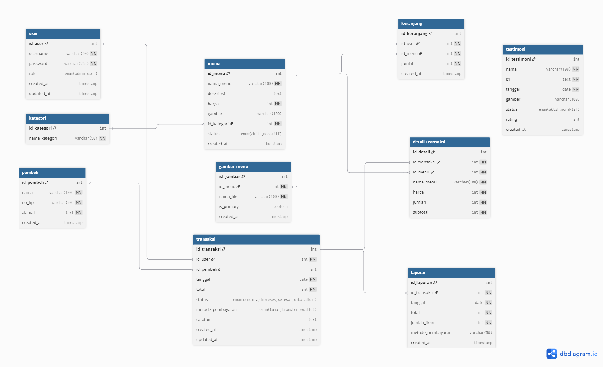

# 🥟 Nun's Dimsum - Sistem Manajemen Restoran Modern

**Proyek Ujian Akhir Semester - Pemrograman Web**  
**Sekolah Tinggi Teknologi Bontang**

---

## 👩‍🎓 Informasi Mahasiswa

| Data | Informasi |
|------|----------|
| **Nama** | Raihana |
| **NIM** | 202312068 |
| **Email** | raihanahan5490@gmail.com |
| **Prodi** | Teknik Informatika |
| **Semester** | Semester 3 |
| **Mata Kuliah** | Pemrograman Web |
| **Tahun Akademik** | 2024/2025 |

### 🌟 Tentang Saya

| Aspek | Detail |
|-------|--------|
| **🎵 Hobi** | Menyanyi |
| **🎨 Warna Favorit** | Sage |
| **🍜 Makanan Favorit** | Chicken Noodle |
| **🥤 Minuman Favorit** | Milo Ice |
| **💭 Moto Kehidupan** | "Jalanin aja" |

---

> Sistem manajemen restoran berbasis web dengan fitur lengkap untuk mengelola menu, pesanan, dan transaksi dengan desain modern dan user experience yang optimal.

[](https://php.net/)
[](https://mysql.com/)
[](LICENSE)
[](.))
[](https://sttbontang.ac.id)

## 📖 Daftar Isi

- [Overview](#-overview)
- [Fitur Utama](#-fitur-utama)
- [Screenshots](#-screenshots)
- [Teknologi](#-teknologi)
- [Instalasi](#-instalasi-cepat)
- [Struktur Project](#-struktur-project)
- [Dokumentasi](#-dokumentasi)
- [Contributing](#-contributing)
- [License](#-license)

## 🌟 Overview

Nun's Dimsum adalah sistem manajemen restoran modern yang dibangun khusus untuk restoran dimsum. Aplikasi ini menyediakan interface yang intuitif untuk admin mengelola operasional restoran dan interface yang user-friendly untuk pelanggan menikmati pengalaman berbelanja online.

### ✨ Mengapa Nun's Dimsum?

- **🎨 Modern UI/UX**: Design responsif dengan hamburger navigation dan animasi smooth
- **📱 Mobile First**: Dioptimalkan untuk semua device, dari mobile hingga desktop
- **🔒 Security**: Implementasi keamanan berlapis dengan bcrypt dan prepared statements
- **⚡ Performance**: Database teroptimasi dengan indexing dan caching strategy
- **📊 Analytics**: Dashboard analitik real-time dengan insights mendalam
- **🛠️ Maintainable**: Code structure yang bersih dan mudah dikembangkan

## 🌟 Fitur Utama

### 👨‍💼 Admin Panel

- **📊 Dashboard Analytics** - Overview penjualan, statistik, dan KPI
- **🍜 Manajemen Menu** - CRUD menu dengan upload gambar dan kategori
- **💳 Manajemen Transaksi** - Kelola pesanan, status, dan pembayaran
- **📈 Laporan Penjualan** - Analisis mendalam dengan filter tanggal dan export
- **⭐ Manajemen Testimoni** - Moderasi review dan rating pelanggan
- **🍔 Hamburger Navigation** - Menu sidebar modern dengan animasi

### 🧑‍💻 User Interface

- **🛍️ Katalog Menu** - Browse menu dengan filter dan pencarian
- **🛒 Keranjang Belanja** - Sistem cart yang mudah dan intuitif
- **📜 Riwayat Transaksi** - Track pesanan dan status real-time
- **💬 Testimoni** - Berikan review dan rating pengalaman
- **🍔 Modern Navigation** - Hamburger menu dengan user info

### 🔥 Fitur Unggulan

- **🎨 Design System Konsisten** - Color palette hijau-pink yang menarik
- **🔄 Real-time Updates** - Status pesanan yang update secara real-time
- **📱 Progressive Web App** - Pengalaman seperti aplikasi native
- **🔍 Advanced Search** - Pencarian menu dengan filter kategori dan harga

## 📱 Screenshots

### Admin Dashboard


### User Interface


### Mobile Responsive


## 🛠️ Teknologi

### Backend

- **PHP 8.0+** - Server-side logic
- **MySQL 8.0+** - Database management
- **bcrypt** - Password hashing
- **Session Management** - User authentication

### Frontend

- **HTML5** - Semantic markup
- **CSS3** - Modern styling dengan Flexbox/Grid
- **JavaScript (ES6+)** - Interactive functionality
- **Font Awesome 6.4.0** - Icon library

### Development Tools

- **XAMPP** - Local development environment
- **phpMyAdmin** - Database administration
- **Git** - Version control

## ⚡ Instalasi Cepat

```bash
# 1. Clone repository
git clone https://github.com/yourusername/nuns-dimsum.git
cd nuns-dimsum

# 2. Setup database (import ke phpMyAdmin)
database/complete_database_setup.sql

# 3. Configure environment
# Edit src/includes/config.php

# 4. Start development server
# Place di htdocs XAMPP dan start Apache + MySQL

# 5. Access application
http://localhost/backup.raihanna
```

**Default Login:**

- Admin: `admin` / `password`
- User: `user` / `password`

## 📁 Struktur Project

```
nuns-dimsum/
├── 📂 src/                     # Source code
│   ├── 📂 includes/            # Core includes
│   │   ├── 🔧 config.php       # Database configuration
│   │   ├── ⚙️ functions.php    # Helper functions
│   │   ├── 🎨 admin_layout.php # Admin layout template
│   │   └── 🎨 user_layout.php  # User layout template
│   └── 📂 views/               # View templates
│       ├── 👨‍💼 admin/           # Admin pages
│       ├── 🔐 auth/            # Authentication
│       ├── 🌐 public/          # Public pages
│       └── 👤 user/            # User pages
├── 📂 public/                  # Public assets
│   └── 📂 uploads/             # File uploads
├── 📂 database/                # Database files
│   └── 📄 complete_database_setup.sql
├── 📂 docs/                    # Documentation
│   ├── 📋 database.md          # Database documentation
│   ├── 🚀 deployment.md       # Deployment guide
│   ├── 💿 installation.md     # Installation guide
│   ├── 📖 usage.md             # Usage guide
│   └── 📊 erd_diagram.png      # ERD diagram
├── 📂 assets/                  # Static assets
│   └── 📂 images/              # Images
├── 📂 logs/                    # System logs
└── 📋 README.md               # This file
```

## 📚 Dokumentasi

### 🗄️ Database Structure


*Entity Relationship Diagram - Struktur database Nun's Dimsum*

### 📖 Panduan Lengkap

- **[🔧 Installation Guide](docs/installation.md)** - Panduan instalasi lengkap
- **[🗄️ Database Documentation](docs/database.md)** - Struktur dan dokumentasi database
- **[🚀 Deployment Guide](docs/deployment.md)** - Panduan deploy ke production
- **[📖 Usage Guide](docs/usage.md)** - Cara penggunaan aplikasi

### 🔗 Quick Links

- [API Documentation](#) - RESTful API docs
- [Component Library](#) - UI component guide
- [Security Guidelines](#) - Security best practices
- [Performance Optimization](#) - Performance tuning guide

## 🎨 Design System

### 🎨 Color Palette

```css
:root {
  --primary-green: #a8e6cf; /* 🟢 Primary brand color */
  --secondary-green: #dcedc8; /* 🟢 Secondary green */
  --accent-green: #88d8a3; /* 🟢 Accent green */
  --dark-green: #2e4e2d; /* 🟢 Dark green for text */
  --primary-pink: #f5b7c2; /* 🩷 Primary pink */
  --secondary-pink: #e890a8; /* 🩷 Secondary pink */
  --light-pink: #fff0f2; /* 🩷 Light pink background */
}
```

### 📱 Responsive Breakpoints

```css
/* Mobile First Approach */
@media (max-width: 768px) {
  /* Mobile */
}
@media (max-width: 1024px) {
  /* Tablet */
}
@media (max-width: 1200px) {
  /* Desktop */
}
@media (min-width: 1201px) {
  /* Large Desktop */
}
```

## 🔒 Security Features

- ✅ **Password Hashing**: bcrypt dengan cost factor 12
- ✅ **SQL Injection Prevention**: Prepared statements
- ✅ **XSS Protection**: Input sanitization dan output encoding
- ✅ **CSRF Protection**: Token validation
- ✅ **File Upload Security**: Type whitelist dan size limit
- ✅ **Session Security**: Secure session handling
- ✅ **Input Validation**: Server-side validation

## 📊 Performance Metrics

- **🚀 Page Load Time**: < 2 seconds
- **📱 Mobile Performance**: 90+ Lighthouse score
- **🔍 SEO Optimized**: Semantic HTML dan meta tags
- **♿ Accessibility**: WCAG 2.1 compliant
- **🗄️ Database**: Optimized queries dengan indexing

## 🧪 Testing

```bash
# Run tests (future implementation)
php vendor/bin/phpunit tests/

# Performance testing
# Use tools like Apache Bench or GTmetrix
ab -n 1000 -c 10 http://localhost/backup.raihanna/
```

## 🤝 Contributing

Kami menerima kontribusi dari community! Berikut cara berkontribusi:

1. **🍴 Fork** repository ini
2. **🌿 Create branch** untuk fitur baru (`git checkout -b feature/amazing-feature`)
3. **💻 Commit** perubahan (`git commit -m 'Add: amazing feature'`)
4. **📤 Push** ke branch (`git push origin feature/amazing-feature`)
5. **🔄 Create Pull Request**

### 📋 Contribution Guidelines

- Follow existing code style
- Write meaningful commit messages
- Add tests for new features
- Update documentation
- Ensure backward compatibility

## 📄 Changelog

### 🎉 v2.0.0 (Current) - Major UI/UX Overhaul

- ✨ **NEW**: Modern hamburger menu navigation
- 🎨 **IMPROVED**: Complete UI/UX redesign dengan design system
- 🔧 **OPTIMIZED**: Database structure dan performance
- 📱 **ENHANCED**: Mobile responsiveness dan PWA features
- 🔒 **SECURITY**: Enhanced security measures
- 🧹 **CLEANUP**: Removed unused files dan optimized structure

### 🔄 v1.0.0 - Initial Release

- Basic restaurant management system
- Admin panel untuk menu dan transaksi
- User interface untuk ordering
- Authentication system

## 📞 Support

- **📧 Email**: support@nunsdimsum.com
- **💬 Discord**: [Join our community](https://discord.gg/nunsdimsum)
- **📱 Telegram**: [@nunsdimsum_support](https://t.me/nunsdimsum_support)
- **🐛 Issues**: [GitHub Issues](https://github.com/yourusername/nuns-dimsum/issues)

## 📄 License

Project ini dilisensikan di bawah **MIT License** - lihat file [LICENSE](LICENSE) untuk detail lengkap.

```
MIT License - Copyright (c) 2025 Nun's Dimsum Project

Permission is hereby granted, free of charge, to any person obtaining a copy
of this software and associated documentation files...
```

## 👨‍💻 Authors & Contributors

**Raihanna Development Team**

- 👤 **Lead Developer**: [Your Name](https://github.com/yourusername)
- 🎨 **UI/UX Designer**: [Designer Name](https://github.com/designer)
- 🗄️ **Database Architect**: [DB Expert Name](https://github.com/dbexpert)

### 🙏 Special Thanks

- Font Awesome team untuk icon library
- PHP community untuk best practices
- Open source contributors

---

<div align="center">

**🥟 Nun's Dimsum - Bringing Authentic Taste to Your Digital Table! 🥟**

[](#)
[](#)
[](#)

[⬆️ Back to Top](#-nuns-dimsum---sistem-manajemen-restoran-modern)

</div>
