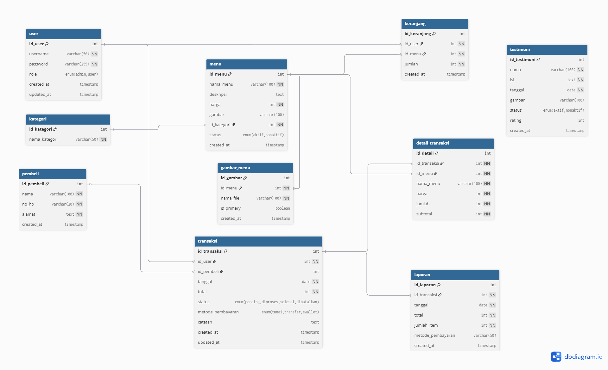

# 🗄️ Database Documentation - QuickRent Car Rental System

---

## 👤 Personal Information
**Name**: Raihanna  
**NIM**: 2101020042  
**Email**: raihanna@students.univ.ac.id  
**Hobbies**: Reading books, traveling, photography  
**Favorite Color**: Blue  
**Favorite Food**: Sushi and Italian pasta  
**Favorite Drink**: Green tea and fresh orange juice  
**Life Motto**: "Every challenge is an opportunity to grow and learn something new."

---

## 🚗 Project Information
**Project Title**: QuickRent Car Rental System  
**Institution**: Universitas ABC  
**Course**: Web Programming (Pemrograman Web)  
**Semester**: 5 (Lima)  
**Academic Year**: 2024/2025  

**Project Description**: A comprehensive web-based car rental management system that allows customers to browse available vehicles, make reservations, and manage their rental history. The system includes admin functionality for vehicle management, booking oversight, and customer service.

---

> Dokumentasi lengkap struktur database, relasi, dan best practices untuk sistem QuickRent Car Rental.

## 📖 Daftar Isi

- [Overview](#-overview)
- [Database Schema](#-database-schema)
- [Table Structures](#-table-structures)
- [Relationships](#-relationships)
- [Indexes & Performance](#-indexes--performance)
- [Views & Procedures](#-views--procedures)
- [Data Migration](#-data-migration)
- [Best Practices](#-best-practices)

## 🌟 Overview

Database Nun's Dimsum dirancang dengan prinsip normalisasi yang baik dan struktur yang scalable. Database menggunakan MySQL 8.0+ dengan fitur modern seperti stored procedures, views, dan indexing yang optimal.

### 📊 Database Statistics
- **Database Name**: `db_nunsdimsum`
- **Total Tables**: 10 tables
- **Total Views**: 2 views
- **Total Procedures**: 5 procedures
- **Storage Engine**: InnoDB
- **Character Set**: utf8mb4_unicode_ci

## 🏗️ Database Schema



### 📋 Table Overview

| Table | Purpose | Records | Relationships |
|-------|---------|---------|--------------|
| `user` | User authentication | Dynamic | Parent to transaksi, keranjang |
| `kategori` | Menu categories | Static | Parent to menu |
| `menu` | Menu items | Dynamic | Child to kategori, parent to detail_transaksi |
| `keranjang` | Shopping cart | Dynamic | Child to user, menu |
| `transaksi` | Order transactions | Dynamic | Child to user, pembeli |
| `detail_transaksi` | Order details | Dynamic | Child to transaksi, menu |
| `pembeli` | Customer info | Dynamic | Parent to transaksi |
| `testimoni` | Customer reviews | Dynamic | Standalone |
| `gambar_menu` | Menu images | Dynamic | Child to menu |
| `laporan` | Reports backup | Dynamic | Child to transaksi |

## 🏗️ Table Structures

### 👤 User Table
```sql
CREATE TABLE user (
  id_user INT AUTO_INCREMENT PRIMARY KEY,
  username VARCHAR(50) NOT NULL UNIQUE,
  password VARCHAR(255) NOT NULL,
  role ENUM('admin', 'user') DEFAULT 'user',
  created_at TIMESTAMP DEFAULT CURRENT_TIMESTAMP,
  updated_at TIMESTAMP DEFAULT CURRENT_TIMESTAMP ON UPDATE CURRENT_TIMESTAMP
);
```

**Purpose**: Menyimpan data user authentication untuk admin dan customer
**Fields**:
- `id_user`: Primary key (Auto increment)
- `username`: Unique identifier untuk login
- `password`: Hashed password (bcrypt)
- `role`: Admin atau user privilege
- `created_at`: Timestamp pembuatan
- `updated_at`: Timestamp terakhir update

### 🍽️ Menu Table
```sql
CREATE TABLE menu (
  id_menu INT AUTO_INCREMENT PRIMARY KEY,
  nama_menu VARCHAR(100) NOT NULL,
  deskripsi TEXT,
  harga INT NOT NULL,
  gambar VARCHAR(100),
  id_kategori INT NOT NULL,
  created_at TIMESTAMP DEFAULT CURRENT_TIMESTAMP,
  FOREIGN KEY (id_kategori) REFERENCES kategori(id_kategori)
);
```

**Purpose**: Menyimpan data menu makanan dan minuman
**Fields**:
- `id_menu`: Primary key
- `nama_menu`: Nama menu item
- `deskripsi`: Deskripsi menu
- `harga`: Harga dalam integer (rupiah)
- `gambar`: Nama file gambar
- `id_kategori`: Foreign key ke tabel kategori
- `created_at`: Timestamp pembuatan

### 🛒 Keranjang Table
```sql
CREATE TABLE keranjang (
  id_keranjang INT AUTO_INCREMENT PRIMARY KEY,
  id_user INT NOT NULL,
  id_menu INT NOT NULL,
  jumlah INT NOT NULL DEFAULT 1,
  created_at TIMESTAMP DEFAULT CURRENT_TIMESTAMP,
  FOREIGN KEY (id_user) REFERENCES user(id_user) ON DELETE CASCADE,
  FOREIGN KEY (id_menu) REFERENCES menu(id_menu) ON DELETE CASCADE,
  UNIQUE KEY unique_user_menu (id_user, id_menu)
);
```

**Purpose**: Temporary storage untuk shopping cart user
**Fields**:
- `id_keranjang`: Primary key
- `id_user`: Foreign key ke user
- `id_menu`: Foreign key ke menu
- `jumlah`: Quantity item
- `unique_user_menu`: Composite unique key

### 💳 Transaksi Table
```sql
CREATE TABLE transaksi (
  id_transaksi INT AUTO_INCREMENT PRIMARY KEY,
  id_user INT NOT NULL,
  id_pembeli INT,
  tanggal DATE NOT NULL,
  total INT NOT NULL,
  status ENUM('pending','diproses','selesai','dibatalkan') DEFAULT 'pending',
  metode_pembayaran ENUM('tunai','transfer','ewallet') DEFAULT 'tunai',
  catatan TEXT,
  created_at TIMESTAMP DEFAULT CURRENT_TIMESTAMP,
  updated_at TIMESTAMP DEFAULT CURRENT_TIMESTAMP ON UPDATE CURRENT_TIMESTAMP,
  FOREIGN KEY (id_user) REFERENCES user(id_user),
  FOREIGN KEY (id_pembeli) REFERENCES pembeli(id_pembeli)
);
```

**Purpose**: Menyimpan data transaksi/pesanan
**Features**:
- Status tracking dengan ENUM
- Multiple payment methods
- Audit trail dengan timestamps
- Soft relationship dengan pembeli

### 📄 Detail Transaksi Table
```sql
CREATE TABLE detail_transaksi (
  id_detail INT AUTO_INCREMENT PRIMARY KEY,
  id_transaksi INT NOT NULL,
  id_menu INT NOT NULL,
  nama_menu VARCHAR(100) NOT NULL,
  harga INT NOT NULL,
  jumlah INT NOT NULL,
  subtotal INT NOT NULL,
  FOREIGN KEY (id_transaksi) REFERENCES transaksi(id_transaksi) ON DELETE CASCADE,
  FOREIGN KEY (id_menu) REFERENCES menu(id_menu)
);
```

**Purpose**: Detail items dalam setiap transaksi
**Features**:
- Snapshot data menu (nama_menu, harga)
- Cascade delete dengan transaksi
- Calculated subtotal field

## 🔗 Relationships

### 🔑 Primary Relationships


### 🔄 Foreign Key Constraints

| Child Table | Parent Table | Constraint | On Delete |
|------------|-------------|------------|-----------|
| menu | kategori | id_kategori | RESTRICT |
| keranjang | user | id_user | CASCADE |
| keranjang | menu | id_menu | CASCADE |
| transaksi | user | id_user | RESTRICT |
| transaksi | pembeli | id_pembeli | RESTRICT |
| detail_transaksi | transaksi | id_transaksi | CASCADE |
| detail_transaksi | menu | id_menu | RESTRICT |

## ⚡ Indexes & Performance

### 🎯 Performance Indexes

```sql
-- Indexes untuk optimasi query
CREATE INDEX idx_transaksi_user ON transaksi(id_user);
CREATE INDEX idx_transaksi_tanggal ON transaksi(tanggal);
CREATE INDEX idx_transaksi_status ON transaksi(status);
CREATE INDEX idx_detail_transaksi ON detail_transaksi(id_transaksi);
CREATE INDEX idx_keranjang_user ON keranjang(id_user);
CREATE INDEX idx_menu_kategori ON menu(id_kategori);
```

### 📊 Query Performance

| Query Type | Index Used | Performance |
|------------|-----------|-------------|
| Login user | username (UNIQUE) | O(1) |
| User transactions | idx_transaksi_user | O(log n) |
| Menu by category | idx_menu_kategori | O(log n) |
| Cart by user | idx_keranjang_user | O(log n) |
| Transaction details | idx_detail_transaksi | O(log n) |

## 👀 Views & Procedures

### 📊 Views

#### `v_menu_terlaris`
```sql
CREATE VIEW v_menu_terlaris AS
SELECT 
    m.id_menu,
    m.nama_menu,
    m.harga,
    k.nama_kategori,
    COALESCE(SUM(dt.jumlah), 0) as total_terjual,
    COALESCE(SUM(dt.subtotal), 0) as total_pendapatan,
    COUNT(DISTINCT dt.id_transaksi) as jumlah_order
FROM menu m
LEFT JOIN kategori k ON m.id_kategori = k.id_kategori
LEFT JOIN detail_transaksi dt ON m.id_menu = dt.id_menu
LEFT JOIN transaksi t ON dt.id_transaksi = t.id_transaksi AND t.status = 'selesai'
GROUP BY m.id_menu, m.nama_menu, m.harga, k.nama_kategori
ORDER BY total_terjual DESC;
```

**Purpose**: Analisis menu terlaris dengan metrics penjualan

#### `v_transaksi_harian`
```sql
CREATE VIEW v_transaksi_harian AS
SELECT 
    DATE(t.tanggal) as tanggal_transaksi,
    COUNT(*) as jumlah_transaksi,
    SUM(CASE WHEN t.status = 'selesai' THEN 1 ELSE 0 END) as transaksi_selesai,
    SUM(CASE WHEN t.status = 'selesai' THEN t.total ELSE 0 END) as total_penjualan,
    AVG(CASE WHEN t.status = 'selesai' THEN t.total ELSE NULL END) as rata_rata_penjualan
FROM transaksi t
GROUP BY DATE(t.tanggal)
ORDER BY tanggal_transaksi DESC;
```

**Purpose**: Daily sales summary untuk reporting

### 🔧 Stored Procedures

#### `GetLaporanPenjualan`
```sql
CALL GetLaporanPenjualan('2024-01-01', '2024-12-31');
```

**Purpose**: Generate sales report dengan filter tanggal
**Parameters**:
- `p_tanggal_mulai`: Start date (optional)
- `p_tanggal_sampai`: End date (optional)

#### `CreateTransaction`
```sql
CALL CreateTransaction(1, 1, 150000, 'tunai', 'Pesanan reguler', @new_id);
```

**Purpose**: Create transaction dengan validation
**Parameters**:
- `p_id_user`: User ID
- `p_id_pembeli`: Pembeli ID
- `p_total`: Total amount
- `p_metode_pembayaran`: Payment method
- `p_catatan`: Notes
- `p_id_transaksi`: OUT parameter (new transaction ID)

## 🔄 Data Migration

### 📦 Initial Setup

```bash
# 1. Import complete database setup
mysql -u root -p < database/complete_database_setup.sql

# 2. Verify tables
SHOW TABLES;

# 3. Check data
SELECT COUNT(*) FROM menu;
SELECT COUNT(*) FROM user;
```

### 🔧 Sample Data

Database sudah include sample data:
- **Users**: admin/user dengan password default
- **Kategori**: Dimsum, Minuman, Makanan Lain
- **Menu**: 8 sample menu items
- **Testimoni**: 3 sample reviews

### 📈 Data Updates

```sql
-- Update existing data
UPDATE menu SET harga = harga * 1.1 WHERE id_kategori = 1;

-- Cleanup orphan data
DELETE k FROM keranjang k
LEFT JOIN menu m ON k.id_menu = m.id_menu
WHERE m.id_menu IS NULL;
```

## 💡 Best Practices

### 🔒 Security

1. **Always use prepared statements**
```php
$stmt = $conn->prepare("SELECT * FROM user WHERE username = ?");
$stmt->bind_param("s", $username);
```

2. **Hash passwords with bcrypt**
```php
$hashed = password_hash($password, PASSWORD_BCRYPT, ['cost' => 12]);
```

3. **Validate input data**
```php
$username = filter_var($_POST['username'], FILTER_SANITIZE_STRING);
```

### ⚡ Performance

1. **Use indexes for frequently queried columns**
2. **Limit SELECT queries with LIMIT clause**
3. **Use appropriate data types**
4. **Regular OPTIMIZE TABLE maintenance**

### 🧹 Maintenance

```sql
-- Monthly maintenance
OPTIMIZE TABLE user, menu, transaksi, detail_transaksi;
ANALYZE TABLE user, menu, transaksi, detail_transaksi;

-- Check table integrity
CHECK TABLE user, menu, transaksi, detail_transaksi;
```

### 📊 Monitoring

```sql
-- Monitor table sizes
SELECT 
    TABLE_NAME,
    ROUND(((DATA_LENGTH + INDEX_LENGTH) / 1024 / 1024), 2) AS 'Size (MB)'
FROM information_schema.TABLES
WHERE TABLE_SCHEMA = 'db_nunsdimsum'
ORDER BY (DATA_LENGTH + INDEX_LENGTH) DESC;

-- Monitor slow queries
SHOW PROCESSLIST;
```

### 🔄 Backup Strategy

```bash
# Daily backup
mysqldump -u root -p db_nunsdimsum > backup_$(date +%Y%m%d).sql

# Weekly full backup with structure
mysqldump -u root -p --routines --triggers db_nunsdimsum > full_backup_$(date +%Y%m%d).sql
```

---

## 📚 Additional Resources

- [MySQL 8.0 Reference Manual](https://dev.mysql.com/doc/refman/8.0/en/)
- [Database Design Best Practices](https://dev.mysql.com/doc/refman/8.0/en/optimization.html)
- [PHP MySQL Best Practices](https://phpbestpractices.org/)

---

**💡 Pro Tip**: Always test database changes in development environment first before applying to production!
